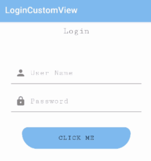

[](https://jitpack.io/#DanielZusev/LoginCustomView)
[](https://opensource.org/licenses/Apache-2.0)

# LoginCustomView
A simple custom login view

## Setup
#### Add it in your root build.gradle at the end of repositories:
```
allprojects {
		repositories {
			...
			maven { url 'https://jitpack.io' }
		}
	}
```
#### Add the dependency
```
dependencies {
	        implementation 'com.github.DanielZusev:LoginCustomView:1.00.01'
	}
```
## Usage


## Xml
```
app:inputTextHint="@string/user_name"
app:passTextHint="@string/Password"
app:buttonText="@string/click"
app:headerText="@string/login"
app:buttonTextColor="@color/black"	
```

## Java

#### Set Header Text
```
loginView.setHeaderText("Login");
```
#### Set Input Text
```
loginView.setInputTextHint("User");
```
#### Set Password Text
```
 loginView.setPassTextHint("Password");
```
#### Set Button Text
```
loginView.setButtonText("Click Me");
```
#### Get Input Text
```
String inputValue = loginView.getInputTextValue();
```
#### Get Password Text
```
 String passValue = loginView.getPassTextValue();
```
#### Set Button Listener
```
loginView.setButtonListener(new View.OnClickListener() {
            @Override
            public void onClick(View v) {
               loginView.setButtonText("Clicked !");
            }
        });
```


